# LLM Privacy Layer

A standalone privacy filter API that anonymizes sensitive information in JSON data before it's sent to language models and deanonymizes responses, designed to work with any LLM application as an external service.

## Overview

LLM Privacy Layer is a FastAPI-based service that acts as a privacy filter for LLM applications. It provides:

- **Privacy preprocessing**: Automatically detects and anonymizes personally identifiable information (PII) in data before it's sent to language models
- **Response postprocessing**: Restores original information in model responses for a seamless user experience
- **External service architecture**: Works as a separate service that doesn't require tight integration with your application code
- **JSON processing**: Handles any JSON structure for flexible integration

## Quick Start

Get up and running quickly with Docker:

```bash
# Clone the repository
git clone https://github.com/yourusername/llm-privacy-layer.git
cd llm-privacy-layer

# Create configuration files (using defaults)
cp .env.example .env
cp app/config/example_profiles.yaml app/config/profiles.yaml

# Start the service
docker-compose up -d

# Service is now running at http://localhost:8010
```

After setup, integrate with your LLM application:
1. Send requests to `http://localhost:8010/api/inlet` before passing to LLM
2. Send LLM responses to `http://localhost:8010/api/outlet` before showing to users

## How It Works

1. Your application calls the Privacy Layer's `inlet` endpoint with the data that would normally go directly to your LLM provider
2. The Privacy Layer detects and replaces PII with anonymized placeholders
3. The service returns the anonymized data to your application, which then sends it to your LLM provider
4. When your application receives a response from the LLM, it sends this response to the Privacy Layer's `outlet` endpoint
5. The Privacy Layer replaces anonymized placeholders with the original data
6. The deanonymized response is returned to your application

This way, sensitive information never reaches the LLM provider's systems.

```mermaid
%%{init: {'theme': 'default', 'themeVariables': { 'primaryColor': '#b5e853', 'primaryTextColor': '#151515', 'primaryBorderColor': '#b5e853', 'lineColor': '#b5e853', 'secondaryColor': '#2a2a2a', 'tertiaryColor': '#151515'}}}%%

flowchart LR
    subgraph Your["Your Environment"]
        App["Your Application"]
        User(("User"))
    end

    subgraph Private["Privacy Layer"]
        Inlet["Privacy Layer<br>(inlet)"]
        Outlet["Privacy Layer<br>(outlet)"]
        
        %% Hidden node for the lock icon
        InvisNode1["🔒"]
        style InvisNode1 fill:none,stroke:none
        
        %% Connection between Inlet and Outlet to show they share data
        Inlet -.->|"Mapping Storage"| InvisNode1
        InvisNode1 -.->|"Mapping Storage"| Outlet
    end

    subgraph External["External Provider"]
        LLM["LLM Provider"]
    end

    %% Data flow - fix labels to avoid list interpretation
    App -->|"① Send data with PII"| Inlet
    Inlet -->|"② Return anonymized data ✓"| App
    App -->|"③ Send anonymized data ✓"| LLM
    LLM -->|"④ Return response with placeholders"| App
    App -->|"⑤ Send response with placeholders"| Outlet
    Outlet -->|"⑥ Return deanonymized response"| App
    App -->|"⑦ Show safe response"| User

    %% Styling
    classDef appNode fill:#b5e853,stroke:#333,stroke-width:1px,color:#1a1a1a;
    classDef privacyNode fill:#4CAF50,stroke:#333,stroke-width:1px,color:white;
    classDef externalNode fill:#FF5722,stroke:#333,stroke-width:1px,color:white;
    classDef userNode fill:#2196F3,stroke:#333,stroke-width:1px,color:white;
    
    class App appNode;
    class Inlet,Outlet privacyNode;
    class LLM externalNode;
    class User userNode;
```



> **Note:** The diagram source is also available as a separate file at [docs/images/privacy_layer_flow.mmd](docs/images/privacy_layer_flow.mmd).

## Features

- Built with FastAPI for high performance
- Uses Microsoft Presidio for robust PII detection and anonymization
- Configurable profiles with custom entity lists and thresholds
- Maintains a mapping between original data and anonymized placeholders
- Provides detailed logging with performance metrics
- Docker containerized for easy deployment
- Runs as a standalone service without dependencies on specific LLM libraries
- Modular architecture with separated components for improved maintainability
- Smart cache management to prevent memory leaks

## Entity Types Detected

The service currently detects the following types of sensitive information:

- Person names
- Email addresses
- Phone numbers
- Locations
- Dates and times
- IP addresses
- Domain names
- URLs
- Numeric patterns (NRP)

## Requirements

- Python 3.10+
- Docker and Docker Compose (for containerized deployment)
- An LLM application that can call external services

## Installation

### Using Docker (Recommended)

1. Clone this repository:
   ```bash
   git clone https://github.com/yourusername/llm-privacy-layer.git
   cd llm-privacy-layer
   ```

2. Create a `.env` file based on the `.env.example` template:
   ```bash
   cp .env.example .env
   # Edit .env with your configuration
   ```

3. Create your profiles configuration file:
   ```bash
   cp app/config/example_profiles.yaml app/config/profiles.yaml
   # Edit profiles.yaml with your preferred configuration (optional)
   ```

4. Build and start the container:
   ```bash
   docker-compose up -d
   ```

### Manual Installation

1. Clone this repository
2. Create a virtual environment:
   ```bash
   python -m venv venv
   source venv/bin/activate  # On Windows: venv\Scripts\activate
   ```

3. Install dependencies:
   ```bash
   pip install -r requirements.txt
   python -m spacy download en_core_web_lg
   python -m spacy download de_core_news_lg
   # (Or download the specific models you intend to use if they differ from the defaults above)
   ```

4. Create your profiles configuration file:
   ```bash
   cp app/config/example_profiles.yaml app/config/profiles.yaml
   # Edit profiles.yaml with your preferred configuration
   ```

5. Start the server:
   ```bash
   uvicorn app.main:app --host 0.0.0.0 --port 8010
   ```

## Integration with Your Application

The privacy layer operates as a stateless API that your application calls in this sequence:

1. Before sending data to an LLM:
   ```
   POST /api/inlet with your JSON payload
   ```

2. After receiving a response from an LLM:
   ```
   POST /api/outlet with the LLM's response
   ```

The privacy mappings are maintained between these calls using a unique identifier automatically added to the metadata.

### Example Integration Flow

```
Your App → LLM Privacy Layer (inlet) → Your App → LLM Provider → Your App → LLM Privacy Layer (outlet) → Your App → User
```

### Example Integration with OpenWebUI

OpenWebUI has a built-in external filter feature that can be configured to use LLM Privacy Layer:

1. Enter the LLM Privacy Layer URL (e.g., `http://localhost:8010`) in OpenWebUI's filter settings
2. Enable the external filter feature

## API Endpoints

- `POST /api/inlet`: Processes incoming data and anonymizes PII
- `POST /api/outlet`: Processes LLM responses and deanonymizes placeholders
- `GET /health`: Health check endpoint

### Example API Requests and Responses

#### Inlet Example

Request to `/api/inlet`:
```json
{
  "messages": [
    {
      "role": "user",
      "content": "My name is John Smith and my email is john.smith@example.com"
    }
  ]
}
```

Response from `/api/inlet`:
```json
{
  "messages": [
    {
      "role": "user",
      "content": "My name is <PERSON_12345678> and my email is <EMAIL_87654321>"
    }
  ],
  "metadata": {
    "privacy_mapping_id": "550e8400-e29b-41d4-a716-446655440000"
  }
}
```

#### Outlet Example

Request to `/api/outlet`:
```json
{
  "response": "I understand, <PERSON_12345678>. I'll send a confirmation to <EMAIL_87654321>.",
  "metadata": {
    "privacy_mapping_id": "550e8400-e29b-41d4-a716-446655440000"
  }
}
```

Response from `/api/outlet`:
```json
{
  "response": "I understand, John Smith. I'll send a confirmation to john.smith@example.com."
}
```

## Performance

The service is designed for minimal latency:
- Typical anonymization processing time: ~0.2 seconds for complex prompts
- Typical deanonymization processing time: <0.001 seconds

## Configuration

### Environment Variables

- `LOG_LEVEL`: Set logging level (default: INFO)
- `LLM_PRIVACY_PROFILE_PATH`: Path to the profiles configuration file (default: app/config/profiles.yaml)
- `LLM_PRIVACY_DEFAULT_PROFILE`: Name of the default profile to use (default: default)
- `LLM_PRIVACY_CACHE_MAPPINGS`: Whether to cache mappings (default: true)
- `LLM_PRIVACY_CACHE_TTL`: Time-to-live for cached mappings in seconds (default: 3600)
- `LLM_PRIVACY_SPACY_MODELS_JSON`: A JSON string specifying the spaCy models to load at runtime.
  Example: `'[{"lang_code": "en", "model_name": "en_core_web_lg"}, {"lang_code": "de", "model_name": "de_core_news_lg"}]'`
  If not set, the application defaults to the models specified in its internal configuration (currently `en_core_web_lg` and `de_core_news_lg`), which are also the defaults downloaded during the Docker image build.

  **Note on Docker Compose:** When using Docker Compose, these environment variables are typically set within your `docker-compose.yml` file for the service.

  **Managing Language Models:**
  The privacy layer can use multiple spaCy language models (e.g., for English and German) to detect PII. Here's how they are managed:
  1.  **Model Availability (Docker Image):** The `Dockerfile` is responsible for downloading a base set of spaCy models when the Docker image is built. By default, it includes models for English (`en_core_web_lg`) and German (`de_core_news_lg`). These are the models available "out-of-the-box" within the container.
  2.  **Model Selection (Runtime):** The `LLM_PRIVACY_SPACY_MODELS_JSON` environment variable (mentioned above) tells the application which of these *available* models to actually load and use when it starts. This allows you to activate only English, only German, or both, from the models included in the image.
  3.  **Using a New Model Not in the Default Image:** If you need to use a spaCy model that isn't part of the default image build (e.g., a model for a different language or a different size):
      *   First, you must add the download command for the new model (e.g., `RUN python -m spacy download your_new_model_name`) to the `Dockerfile`.
      *   Then, rebuild the Docker image (e.g., using `docker-compose build app_service_name` or `docker build -t your_image_name .`).
      *   Finally, update the `LLM_PRIVACY_SPACY_MODELS_JSON` environment variable (e.g., in your `docker-compose.yml` or `.env` file) to include this new model in the list of models the application should load.

#### Advanced Configuration

These options can be adjusted for fine-tuning the anonymizer's behavior:

- `LLM_PRIVACY_MAPPING_STORE_SIZE`: Maximum number of mapping sets to keep in memory (default: 100)
- `LLM_PRIVACY_MIN_ENTITY_LENGTH`: Minimum length for an entity to be considered in fuzzy matching (default: 2)
- `LLM_PRIVACY_MAX_PHRASE_WORDS`: Maximum number of words to consider in phrase matching (default: 5)

For most users, the default values work well. Adjusting these is only necessary for specific use cases:

- Increase `MAPPING_STORE_SIZE` for high-volume systems with many concurrent requests
- Lower `MIN_ENTITY_LENGTH` if you need to match very short names (already set to 2 by default)
- Increase `MAX_PHRASE_WORDS` if you have very long multi-word entities to match

- `REMOTE_HOST`: For deployment script, the remote server hostname
- `REMOTE_USER`: For deployment script, the remote server username
- `REMOTE_DIR`: For deployment script, the remote directory path

### Profiles Configuration

The anonymizer supports profiles for customized anonymization behavior. Profiles are defined in YAML format and stored in `app/config/profiles.yaml`. Each profile can specify:

> **Note:** The `profiles.yaml` file is included in `.gitignore` and must be created from `example_profiles.yaml` as described in the Installation section.

- **Custom Entity Lists**: Predefined entities to always anonymize 
- **Entity-Specific Thresholds**: Different confidence thresholds for different entity types
- **Skip Terms**: Terms that should never be anonymized
- **Fuzzy Matching**: Settings for fuzzy matching of custom entities

Example profile configuration:

```yaml
profiles:
  default:
    thresholds:
      PERSON: 0.85
      EMAIL_ADDRESS: 0.75
      LOCATION: 0.90
      DEFAULT: 0.85
    custom_entities:
      PERSON:
        - "John Doe"
        - "Jane Smith"
      ORGANIZATION:
        - "Acme Corporation"
    fuzzy_match:
      enabled: true
      thresholds:
        PERSON: 85
        DEFAULT: 80
    skip_terms:
      - "monday"
      - "tuesday"
      - "user"
      - "assistant"
  
  high_security:
    description: "Profile with lower thresholds to catch more potential PII"
    thresholds:
      DEFAULT: 0.6
```

### Anonymization Control

You can control anonymization behavior through profiles:

- **Disable Entity Type**: Set threshold to 1.0 to effectively disable detection for a specific entity type
- **Aggressive Anonymization**: Set threshold below 0.5 for maximum (but potentially noisy) PII detection
- **Custom Skip Terms**: Add domain-specific terms that should never be anonymized
- **Custom Entities**: Add known PII entities that should always be anonymized

### Code Configuration

The following settings can be adjusted in the code:

- **Confidence Threshold**: Default thresholds are defined in the profiles. Higher values reduce false positives but may miss some PII. Lower values catch more potential PII but increase false positives.
- **Entity Types**: The specific types of PII to detect and anonymize can be modified in the `operators` dictionary.

## Deployment

For deployment to a home server, a convenience script is included:

```bash
./deploy-to-homeserver.sh
```

The script uses environment variables from your `.env` file for configuration.

## Security Considerations

- By default, CORS is configured to allow all origins. In production, restrict this to your application URL.
- The service currently maintains anonymization mappings in memory. For production use, consider implementing a more persistent storage solution.
- No PII is stored permanently - mappings exist only for the duration of the request/response cycle.

## Troubleshooting

- Check logs for detailed information about detected entities and processing times
- If too many false positives are detected, increase the confidence threshold
- If important PII is being missed, decrease the confidence threshold

## Testing

Run the test suite to verify anonymization and deanonymization:

```bash
make test
```

Test results will be available in `test_reports/test_results.md`.

## License

[MIT License](LICENSE)

## Acknowledgements

- [Microsoft Presidio](https://github.com/microsoft/presidio) for PII detection and anonymization
- [FastAPI](https://fastapi.tiangolo.com/) framework 

## Architecture

The anonymizer module is designed with a modular architecture:

- **Core**: Main entry points for anonymization and deanonymization
- **Processors**: Text processing functionality with Presidio integration
- **Matchers**: Entity matching for both exact and fuzzy matching
- **Store**: Efficient mapping storage with automatic cache management
- **Recursion**: Handles complex JSON structures recursively
- **Profiles**: Manages anonymization profiles and configurations

This architecture supports:
- Efficient handling of both short and long entity names
- Memory-optimized storage to prevent leaks during extended use
- Clear separation of concerns for improved maintainability
- Extensibility for adding new languages and entity types 

## Mapping Cache System

### What It Does

The mapping cache system is like a temporary memory that connects your original sensitive information with its anonymized placeholders. Here's what it does in simple terms:

1. **Remembers Translations**: When the service replaces "John Smith" with something like "<PERSON_12345678>", it remembers this connection.
   
2. **Connects Requests and Responses**: When a response comes back from the LLM containing "<PERSON_12345678>", the service knows to put "John Smith" back in its place.

3. **Maintains Privacy**: Your sensitive information stays in the service's temporary memory and never gets sent to the LLM provider.

4. **Cleans Up After Itself**: The system automatically removes older information to keep memory usage low.

### How It Works For Users

You don't need to manage the cache at all - it works automatically:

1. When you send data to the `inlet` endpoint, the service creates a unique ID for your request.
2. This ID is included with the anonymized data sent back to you.
3. When you send the LLM's response to the `outlet` endpoint, the service uses this ID to find the right mapping.
4. Your original information is restored in the final response.

### Practical Benefits

- **Privacy**: Sensitive information never leaves your system
- **Consistency**: The same personal information is always replaced and restored consistently
- **No Setup Required**: The mapping system works out of the box
- **Low Overhead**: The system adds minimal processing time (less than 1 millisecond for deanonymization)

### Configuration Options

If needed, you can adjust these settings (but defaults work well for most users):

- **Cache Size**: How many different sets of mappings to keep in memory at once (default: 100)
- **Cache Duration**: How long to keep mappings before discarding them (default: 1 hour)
- **Cache On/Off**: Whether to use caching at all (default: enabled)

You can change these with environment variables if your system processes many requests or needs to retain mappings for longer periods. 